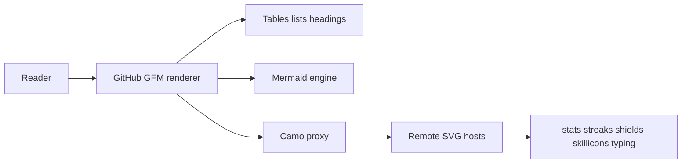
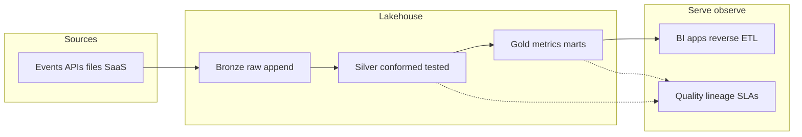

<div align="center">

<pre>
┌────────────────────────────────────────────────┐
│ ojasshukla01/ojasshukla01 · PRIVATE · README  │
│ senior_data_engineer · data + OSS              │
└────────────────────────────────────────────────┘
</pre>


<br />

<a href="https://portfolio-ojas-shuklas-projects-7dc8ad06.vercel.app/" target="_blank"></a>
<a href="https://medium.com/@ojasshukla01" target="_blank"></a>
<a href="https://www.linkedin.com/in/ojasshukla01" target="_blank"></a>
<a href="mailto:ojasshukla01@gmail.com" target="_blank"></a>
<a href="https://github.com/ojasshukla01?tab=repositories" target="_blank"></a>

<br /><br />

[](https://github.com/ojasshukla01)

</div>

> **Repository visibility:** This repo (`ojasshukla01/ojasshukla01`) is **private**. Only you (and collaborators you invite) can browse its files on GitHub.  
> **Profile README rule:** GitHub only shows a profile `README.md` on your **public** profile when the **username-named repository is public**. If this repo stays private, this README **will not appear** on [your public profile](https://github.com/ojasshukla01) for other users — see [Managing your profile README](https://docs.github.com/en/account-and-profile/how-tos/setting-up-and-managing-your-github-profile/customizing-your-profile/managing-your-profile-readme). To keep the README **hidden** but still use this file for yourself or collaborators, leaving it private is correct. To **show** it to everyone, make this repository **public** (your other projects can stay private).

---

### Navigate

[Overview](#overview) · [README spec](#readme-specification) · [Platform model](#data-platform-model) · [Tooling](#tooling) · [Flagship repos](#flagship-repositories) · [Full index](#repository-index) · [Presence](#online-presence) · [Activity](#activity) · [Principles](#operating-principles) · [Contact](#contact-and-availability)

---

## Overview

Senior **data engineer** (6+ years) building **cloud-native** analytics platforms on **AWS**, **GCP**, **Azure**, and **Snowflake**, with strong **Kafka**, **dbt**, **DuckDB**, and **lakehouse** work. I ship **real-time and batch** pipelines, **observability and governance**, and **open-source** tools:

| Area | Project | Role |
|------|---------|------|
| Synthetic data | [**Data Forge**](https://github.com/ojasshukla01/data-forge) | Schema-aware, time-consistent test data for DBs, APIs, pipelines |
| Agent safety | [**SQLSense**](https://github.com/ojasshukla01/sqlsense) | MCP server — guardrailed, audited SQL for AI agents |
| Developer UX | [**token-doctor**](https://github.com/ojasshukla01/token-doctor) | Local-first CLI — tokens, changelogs, sunsets, calendars |

```ini
; machine-readable shorthand (illustrative)
[profile]
title   = senior_data_engineer
lanes   = streaming, batch, governance, synthetic_data, agent_safety
stores  = snowflake, bigquery, duckdb, lakehouse
orchestration = airflow, cicd, terraform
```

---

## README specification

This file lives in the [**profile repository**](https://docs.github.com/en/account-and-profile/how-tos/setting-up-and-managing-your-github-profile/customizing-your-profile/managing-your-profile-readme) `ojasshukla01/ojasshukla01`, which is **private**: there is **no public “View code”** link for strangers, and **badges that call the GitHub API for this repo** (for example “last commit” on *this* repo) will **not** work for anonymous viewers without your own Shields token.

Technically it is plain **GFM** + **remote SVGs** + **Mermaid**. The **component manifest** below documents how that stack fits together (useful for you or anyone with repo access; it is **not** an invitation to clone this private repo from the open internet).

<details>
<summary><strong>Human-readable dependency table</strong></summary>

| Component | Purpose | Upstream |
|-----------|---------|----------|
| Animated lines | Hero / footer copy | [DenverCoder1/readme-typing-svg](https://github.com/DenverCoder1/readme-typing-svg) |
| Skill strip | Compact toolchain | [skillicons.dev](https://skillicons.dev) |
| Stats & languages | GitHub API cards (public tier; rate limits) | [anuraghazra/github-readme-stats](https://github.com/anuraghazra/github-readme-stats) |
| Streak | Contribution streak | [DenverCoder1/github-readme-streak-stats](https://github.com/DenverCoder1/github-readme-streak-stats) (Demolab mirror) |
| Timeline | Year activity graph | [Ashutosh00710/github-readme-activity-graph](https://github.com/Ashutosh00710/github-readme-activity-graph) |
| Chips | Links & metadata | [Shields.io](https://shields.io) |
| Views | Profile hit counter | [antonkomarev/github-profile-views-counter](https://github.com/antonkomarev/github-profile-views-counter) |
| Diagrams | Native render | [Mermaid on GitHub](https://github.blog/2022-02-14-include-diagrams-markdown-files-mermaid/) |

**Emoji-only section markers** below avoid brittle hotlinked icon PNGs.

**If you copy ideas into your own (e.g. public) profile repo:** replace `ojasshukla01` in URLs; self-host **github-readme-stats** if you need private-repo metrics or `include_all_commits`; keep attribution to upstream widget projects.

</details>

```json
{
  "kind": "github-profile-readme",
  "repository": "ojasshukla01/ojasshukla01",
  "visibility": "private",
  "public_profile_readme": false,
  "note": "GitHub shows profile README only when username repo is public; see GitHub docs.",
  "markdown": "GitHub-Flavored-Markdown",
  "dynamic_assets": [
    { "id": "typing-hero", "format": "svg", "host": "readme-typing-svg.herokuapp.com" },
    { "id": "typing-footer", "format": "svg", "host": "readme-typing-svg.herokuapp.com" },
    { "id": "skill-icons", "format": "svg", "host": "skillicons.dev" },
    { "id": "github-stats", "format": "svg", "host": "github-readme-stats.vercel.app" },
    { "id": "streak", "format": "svg", "host": "streak-stats.demolab.com" },
    { "id": "top-langs", "format": "svg", "host": "github-readme-stats.vercel.app" },
    { "id": "activity-graph", "format": "svg", "host": "github-readme-activity-graph.vercel.app" },
    { "id": "profile-views", "format": "svg", "host": "komarev.com" }
  ],
  "static_semantics": ["mermaid", "tables", "details-summary", "fenced-code-blocks"]
}
```

### How GitHub turns this file into a page



---

## Data platform model

Reference **lakehouse** shape I use when designing ingest → serve stacks (illustrative):



---

## Tooling

**Skill snapshot** (generated SVG — not every tool below appears on [skillicons.dev](https://skillicons.dev)):

<div align="center">


</div>

| Domain | Technologies |
|--------|----------------|
| **Languages** | [Python](https://python.org), SQL, [JavaScript](https://developer.mozilla.org/docs/Web/JavaScript), [R](https://www.r-project.org), [Scala](https://scala-lang.org) |
| **Cloud** | [GCP](https://cloud.google.com), [AWS](https://aws.amazon.com), [Azure](https://azure.microsoft.com), [Snowflake](https://www.snowflake.com) |
| **Data & streaming** | [Spark](https://spark.apache.org), [Databricks](https://www.databricks.com), [BigQuery](https://cloud.google.com/bigquery), [Kafka](https://kafka.apache.org), [Airflow](https://airflow.apache.org), [dbt](https://www.getdbt.com), [DuckDB](https://duckdb.org) |
| **Delivery** | [Docker](https://www.docker.com), [Terraform](https://www.terraform.io), [GitHub Actions](https://github.com/features/actions), [Kubernetes](https://kubernetes.io) |

<div align="center">


</div>

---

## Flagship repositories

Pinned and highest-signal OSS (issues / PRs welcome where a repo is licensed and documents contributions):

| Project | What it is | Stack |
|---------|------------|-------|
| 🌿 [**OpenCompliance ESG**](https://github.com/ojasshukla01/opencompliance-esg) | ESG analytics, PDF reporting, DQ | Streamlit, FastAPI, DuckDB, Python |
| 📊 [**Data Forge**](https://github.com/ojasshukla01/data-forge) | Time-aware synthetic data; DDL/OpenAPI; CDC-style exports | Python, FastAPI, Next.js, DuckDB, warehouses |
| 🧠 [**LLM Learning Path Generator**](https://github.com/ojasshukla01/llm-learning-path-generator) | LLM-driven learning paths & gaps | Streamlit, LangChain, DuckDB, OpenAI |
| 🔑 [**token-doctor**](https://github.com/ojasshukla01/token-doctor) | Token debug, changelogs, sunsets, ICS — local-first | Python, SQLite, CLI |
| 🛡️ [**SQLSense**](https://github.com/ojasshukla01/sqlsense) | Safe audited SQL over MCP for agents | Python, MCP |
| 🏥 [**Health Analytics BI Dashboard**](https://github.com/ojasshukla01/health-analytics-bi-dashboard) | Healthcare KPIs & BI patterns | Power BI, analytics |

---

## Repository index

### Data platforms & pipelines

- 🏭 [**Lakehouse360**](https://github.com/ojasshukla01/lakehouse360) — Ingest, transform, DQ; Streamlit, DuckDB, dbt  
- 📈 [**Data Engineering Case Studies**](https://github.com/ojasshukla01/data-engineering-case-studies) — Batch/streaming, BigQuery, Airflow, dbt  
- 🗺️ [**auto-map-au**](https://github.com/ojasshukla01/auto-map-au) (AutoMap360) — Suburb→region geospatial (AU, NZ, IN), Streamlit QA  
- 📦 [**data-pipeline**](https://github.com/ojasshukla01/data-pipeline) — Pipeline reference project  
- ▶️ [**bharatstream-sql**](https://github.com/ojasshukla01/bharatstream-sql) — SQL + analytics backend  
- 🎬 [**streaming-platform**](https://github.com/ojasshukla01/streaming-platform) — Video stack with React  

### Apps, tooling & experiments

- 💬 [**prompt-hub**](https://github.com/ojasshukla01/prompt-hub) — Prompt sharing / management  
- 🔧 [**git-activity-simulator**](https://github.com/ojasshukla01/git-activity-simulator) — CLI for synthetic Git activity (demos / learning)  
- 🌐 [**ojas-portfolio**](https://github.com/ojasshukla01/ojas-portfolio) — Portfolio source  
- 📄 [**sop_generator_app**](https://github.com/ojasshukla01/sop_generator_app) · [**sop-generator-frontend**](https://github.com/ojasshukla01/sop-generator-frontend) — SOP tooling  
- 🔒 [**web-bases-analysis-intrusion-detection-system**](https://github.com/ojasshukla01/web-bases-analysis-intrusion-detection-system) — IDS analysis  
- 🧪 [**sql-injection**](https://github.com/ojasshukla01/sql-injection) — Lab (C#)  
- 🧲 [**Torrent_automate**](https://github.com/ojasshukla01/Torrent_automate) — Automation utilities  
- 🤗 [**hug-lite**](https://github.com/ojasshukla01/hug-lite) — Small HF-related experiment  

---

## Online presence

| Channel | Link | Notes |
|---------|------|--------|
| 🌐 Portfolio | [Vercel — portfolio](https://portfolio-ojas-shuklas-projects-7dc8ad06.vercel.app/) | Case studies, projects, experience |
| ✍️ Writing | [Medium @ojasshukla01](https://medium.com/@ojasshukla01) | Data engineering & practice posts |

Stack for the site: `React` · `Next.js` · `Tailwind CSS` · `Vercel`

---

## Activity

<div align="center">

<a href="https://github.com/ojasshukla01"></a>
<a href="https://github.com/ojasshukla01"></a>

<br /><br />

<a href="https://github.com/ojasshukla01"></a>

<br /><br />

<a href="https://github.com/ojasshukla01"></a>

</div>

---

## Operating principles

- 💡 **Innovation** — Prefer small, composable designs that teams can evolve.  
- ⭐ **Excellence** — Tests, contracts, and observability where it matters.  
- 🤝 **Collaboration** — Clear docs and kind review; OSS when it helps others.  
- 📈 **Growth** — Streaming systems, lakehouses, and agent-era data safety.  

**Outside the terminal:** 🏊 swimming · 🎮 Dota 2 · 📚 LLMs & data tech  

---

## Contact and availability

Open to **senior data engineering** roles, **consulting**, **technical writing**, and **mentoring**. **Sydney, Australia** 🇦🇺

<div align="center">

<a href="mailto:ojasshukla01@gmail.com?subject=Data%20engineering%20%E2%80%94%20hello"></a>
<a href="https://www.linkedin.com/in/ojasshukla01" target="_blank"></a>
<a href="https://portfolio-ojas-shuklas-projects-7dc8ad06.vercel.app/" target="_blank"></a>
<a href="https://medium.com/@ojasshukla01" target="_blank"></a>

<br /><br />

<a href="https://buymeacoffee.com/ojasshuklav" target="_blank"></a>

</div>

---

<div align="center">

> *Excellence in data engineering is not just about building systems — it is about architecting solutions that scale, adapt, and deliver measurable business value.*

**Ojas Shukla** · Senior Data Engineer

<br />


<br /><br />

<sub>Layout reference for maintainers with repo access. Widgets are third-party; this repository’s source is not public unless you change visibility. See GitHub docs for profile README + visibility.</sub>

</div>
