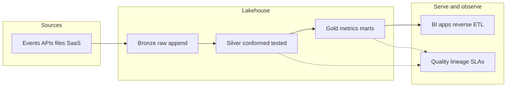

<div align="center">


<br>

<a href="https://portfolio-ojas-shuklas-projects-7dc8ad06.vercel.app/" target="_blank">
  
</a>
<a href="https://medium.com/@ojasshukla01" target="_blank">
  
</a>
<a href="https://www.linkedin.com/in/ojasshukla01" target="_blank">
  
</a>
<a href="mailto:ojasshukla01@gmail.com" target="_blank">
  
</a>

<br><br>

[](https://github.com/ojasshukla01)
[](https://github.com/ojasshukla01/ojasshukla01/commits/main)

</div>

---

### Navigate

[About](#about-me) · [Architecture view](#data-platform-mental-model) · [Stack](#technical-expertise) · [Featured](#featured-projects) · [All repos](#more-repositories) · [Analytics](#github-analytics) · [Connect](#connect-with-me)

---

<details>
<summary><strong>Contributor note</strong> — how this profile README is built (fork-friendly)</summary>

This file is plain **GitHub Flavored Markdown** in the special repository [`ojasshukla01/ojasshukla01`](https://github.com/ojasshukla01/ojasshukla01). Nothing here is a proprietary template; it is assembled from small, composable pieces you can reuse:

| Piece | Role | Source |
|------|------|--------|
| Typing header / footer | Animated SVG text | [DenverCoder1/readme-typing-svg](https://github.com/DenverCoder1/readme-typing-svg) |
| Skill strip | One-glance toolchain | [skillicons.dev](https://skillicons.dev) |
| Stats / top languages | Live GitHub API (public instance; rate limits apply) | [anuraghazra/github-readme-stats](https://github.com/anuraghazra/github-readme-stats) |
| Contribution streak | Streak card (Demolab mirror) | [DenverCoder1/github-readme-streak-stats](https://github.com/DenverCoder1/github-readme-streak-stats) |
| Activity graph | Commit timeline SVG | [Ashutosh00710/github-readme-activity-graph](https://github.com/Ashutosh00710/github-readme-activity-graph) |
| Badges | Version / link chips | [Shields.io](https://shields.io) |
| Profile views | Hit counter | [antonkomarev/github-profile-views-counter](https://github.com/antonkomarev/github-profile-views-counter) |
| Diagram below | Rendered natively by GitHub | [Mermaid](https://github.blog/2022-02-14-include-diagrams-markdown-files-mermaid/) |

**Icons:** Section markers use **Unicode emoji** only (no hotlinked icon CDNs), so the page stays readable even when third-party image proxies fail.

**If you fork this layout:** swap `username` in URLs, self-host **github-readme-stats** if you need `include_all_commits` or private-repo metrics (requires a token), and keep attributions to the upstream projects above.

</details>

---

<div align="center">

## About Me

> **Senior Data Engineer** with **6+ years** designing cloud-native data platforms on **AWS**, **GCP**, **Azure**, and **Snowflake**—heavy on **Kafka**, **dbt**, **DuckDB**, and lakehouse patterns. I build **real-time and batch** pipelines, observability and governance, and **open-source** tooling: **schema-aware synthetic data** ([Data Forge](https://github.com/ojasshukla01/data-forge)), **safe SQL for AI agents via MCP** ([SQLSense](https://github.com/ojasshukla01/sqlsense)), and a **local-first token lifecycle CLI** ([token-doctor](https://github.com/ojasshukla01/token-doctor)).

</div>

```text
# quick context (same story, systems shape)
role            = senior_data_engineer
lanes           = streaming | batch | governance | synthetic_data | agent_safety
warehouses      = snowflake | bigquery | duckdb | lakehouse
orchestration   = airflow | cicd | infra_as_code
```

---

## Data platform mental model

High-level pattern I use when designing pipelines and platforms (illustrative, not project-specific):



---

## Technical Expertise

<div align="center">

**Stack snapshot** (icons are generated from [skillicons.dev](https://skillicons.dev); not every tool above has an icon there)


<br><br>

### 💻 Programming Languages
<a href="https://python.org" target="_blank">
  
</a>
<a href="https://www.microsoft.com/en-us/sql-server" target="_blank">
  
</a>
<a href="https://javascript.info" target="_blank">
  
</a>
<a href="https://www.r-project.org" target="_blank">
  
</a>
<a href="https://scala-lang.org" target="_blank">
  
</a>

<br><br>

### ☁️ Cloud Platforms
<a href="https://cloud.google.com" target="_blank">
  
</a>
<a href="https://aws.amazon.com" target="_blank">
  
</a>
<a href="https://azure.microsoft.com" target="_blank">
  
</a>
<a href="https://snowflake.com" target="_blank">
  
</a>

<br><br>

### 🗄️ Data Platforms & Tools
<a href="https://spark.apache.org" target="_blank">
  
</a>
<a href="https://databricks.com" target="_blank">
  
</a>
<a href="https://cloud.google.com/bigquery" target="_blank">
  
</a>
<a href="https://kafka.apache.org" target="_blank">
  
</a>
<a href="https://airflow.apache.org" target="_blank">
  
</a>
<a href="https://getdbt.com" target="_blank">
  
</a>
<a href="https://duckdb.org" target="_blank">
  
</a>

<br><br>

### ⚙️ DevOps & Infrastructure
<a href="https://docker.com" target="_blank">
  
</a>
<a href="https://terraform.io" target="_blank">
  
</a>
<a href="https://github.com/features/actions" target="_blank">
  
</a>
<a href="https://kubernetes.io" target="_blank">
  
</a>

</div>

---

<div align="center">

## Featured Projects

*Aligned with [pinned repositories](https://github.com/ojasshukla01?tab=repositories) and flagship data-engineering work. On any public repo here: **issues and PRs welcome** where the project has a license and contribution guidelines.*

<table>
<tr>
<td width="50%" align="left">

<div align="center">

### 🌿 [OpenCompliance ESG](https://github.com/ojasshukla01/opencompliance-esg)

</div>

**ESG data pipeline and analytics**

- Real-time ESG metrics dashboard
- Automated PDF reporting
- End-to-end data quality monitoring

**Tech Stack:** `Streamlit` `FastAPI` `DuckDB` `Python`

</td>
<td width="50%" align="left">

<div align="center">

### 📊 [Data Forge](https://github.com/ojasshukla01/data-forge)

</div>

**Time-aware synthetic data platform**

- Schema-driven generation (DDL, JSON Schema, OpenAPI); FKs and business rules
- Snapshot, incremental, and CDC-style flows; exports to Parquet, warehouses, and dbt seeds
- Next.js product UI + Python API—local-first, privacy-safe test data

**Tech Stack:** `Python` `Next.js` `FastAPI` `DuckDB` `PostgreSQL` `Snowflake` `BigQuery`

</td>
</tr>
<tr>
<td width="50%" align="left">

<div align="center">

### 🧠 [LLM Learning Path Generator](https://github.com/ojasshukla01/llm-learning-path-generator)

</div>

**AI-powered learning roadmaps**

- Personalized paths with LLMs, skill-gap analysis, adaptive recommendations

**Tech Stack:** `Streamlit` `LangChain` `DuckDB` `OpenAI`

</td>
<td width="50%" align="left">

<div align="center">

### 🔑 [token-doctor](https://github.com/ojasshukla01/token-doctor)

</div>

**Local-first API token lifecycle CLI**

- Validate tokens, infer JWT expiry, track 50+ platform changelogs and sunsets
- OS keychain storage, ICS calendar exports, Markdown/JSON reports—no telemetry

**Tech Stack:** `Python` `SQLite` CLI

</td>
</tr>
<tr>
<td width="50%" align="left">

<div align="center">

### 🛡️ [SQLSense](https://github.com/ojasshukla01/sqlsense)

</div>

**Safe, audited SQL for AI agents (MCP)**

- Guardrails, read-only by default, audit log, auto-`LIMIT`, column blocklists
- SQLite, PostgreSQL, SQL Server, Snowflake

**Tech Stack:** `Python` `MCP`

</td>
<td width="50%" align="left">

<div align="center">

### 🏥 [Health Analytics BI Dashboard](https://github.com/ojasshukla01/health-analytics-bi-dashboard)

</div>

**Healthcare analytics and BI**

- KPI dashboards and reporting patterns with Power BI

**Tech Stack:** `Power BI` `Analytics`

</td>
</tr>
</table>

</div>

---

## Portfolio & Writing

<div align="center">

### 🌐 [Professional Portfolio](https://portfolio-ojas-shuklas-projects-7dc8ad06.vercel.app/)
**Interactive Data Engineering Showcase**

Modern, responsive design with integrated project galleries, case studies, and professional experience details.

**Tech Stack:** `React` `Next.js` `Tailwind CSS` `Vercel`

---

### ✍️ [Technical Writing](https://medium.com/@ojasshukla01)
**Data Engineering Blog & Industry Insights**

In-depth technical articles, best practices, tutorials, industry insights on data engineering, and skillful portfolio design strategies.

**Platform:** `Medium` `Technical Writing` `Community`

</div>

---

## More Repositories

**Data platforms and pipelines**

- **🏭 [Lakehouse360](https://github.com/ojasshukla01/lakehouse360)** — Ingestion, transformation, data quality, Streamlit + DuckDB + dbt
- **📈 [Data Engineering Case Studies](https://github.com/ojasshukla01/data-engineering-case-studies)** — Batch/streaming patterns, BigQuery, Airflow, dbt
- **🗺️ [auto-map-au](https://github.com/ojasshukla01/auto-map-au) (AutoMap360)** — Suburb→region geospatial pipeline (AU, NZ, IN), shapefiles, Streamlit QA
- **📦 [data-pipeline](https://github.com/ojasshukla01/data-pipeline)** — Data engineering pipeline project
- **▶️ [BharatStream SQL](https://github.com/ojasshukla01/bharatstream-sql)** — SQL backend with analytics
- **🎬 [streaming-platform](https://github.com/ojasshukla01/streaming-platform)** — Video streaming stack with React

**Apps, tooling, and experiments**

- **💬 [prompt-hub](https://github.com/ojasshukla01/prompt-hub)** — Community-driven prompt sharing and management
- **🔧 [git-activity-simulator](https://github.com/ojasshukla01/git-activity-simulator)** — CLI to simulate commits, PRs, and activity for demos and learning
- **🌐 [ojas-portfolio](https://github.com/ojasshukla01/ojas-portfolio)** — Portfolio site source
- **📄 [sop_generator_app](https://github.com/ojasshukla01/sop_generator_app)** / **[sop-generator-frontend](https://github.com/ojasshukla01/sop-generator-frontend)** — SOP generator (Python + JS)
- **🔒 [web-bases-analysis-intrusion-detection-system](https://github.com/ojasshukla01/web-bases-analysis-intrusion-detection-system)** — Web-based intrusion detection analysis
- **🧪 [sql-injection](https://github.com/ojasshukla01/sql-injection)** — SQL injection lab (C#)
- **🧲 [Torrent_automate](https://github.com/ojasshukla01/Torrent_automate)** — Automation utilities
- **🤗 [hug-lite](https://github.com/ojasshukla01/hug-lite)** — Lightweight Hugging Face–related experiment

---

## GitHub Analytics

<div align="center">

<a href="https://github.com/ojasshukla01">
  
</a>

<br><br>

<a href="https://github.com/ojasshukla01">
  
</a>

<br><br>

<a href="https://github.com/ojasshukla01">
  
</a>

<br><br>

<a href="https://github.com/ojasshukla01">
  
</a>

</div>

---

## Professional Philosophy

<div align="center">

<table>
<tr>
<td width="25%" align="center">

### 💡 Innovation
*Driving technological advancement through creative problem-solving*

</td>
<td width="25%" align="center">

### ⭐ Excellence
*Maintaining highest standards in code quality and system design*

</td>
<td width="25%" align="center">

### 🤝 Collaboration
*Fostering knowledge sharing and team growth*

</td>
<td width="25%" align="center">

### 📈 Growth
*Continuous learning and adaptation to emerging technologies*

</td>
</tr>
</table>

</div>

---

## Personal Interests

<div align="center">

<table>
<tr>
<td width="33%" align="center">

### 🏊 Swimming
*Maintaining physical fitness and mental clarity*

</td>
<td width="33%" align="center">

### 🎮 Strategic Gaming
*Enhancing problem-solving skills through Dota 2*

</td>
<td width="33%" align="center">

### 📚 Continuous Learning
*Exploring LLMs and emerging data technologies*

</td>
</tr>
</table>

</div>

---

## Connect with Me

<div align="center">

I'm always open to discussing data engineering challenges, innovative projects, or collaboration opportunities.

<br>

<a href="https://portfolio-ojas-shuklas-projects-7dc8ad06.vercel.app/">
  
</a>
<a href="https://medium.com/@ojasshukla01" target="_blank">
  
</a>
<a href="https://www.linkedin.com/in/ojasshukla01" target="_blank">
  
</a>
<a href="mailto:ojasshukla01@gmail.com" target="_blank">
  
</a>
<a href="https://github.com/ojasshukla01" target="_blank">
  
</a>

</div>

---

## Current Availability

<div align="center">

<table>
<tr>
<td width="25%" align="center">

### 💼 Full-time Roles
*Senior Data Engineering positions*

</td>
<td width="25%" align="center">

### 🤝 Consulting
*Contract and project-based work*

</td>
<td width="25%" align="center">

### ✍️ Writing
*Technical content and documentation*

</td>
<td width="25%" align="center">

### 🎓 Mentoring
*Knowledge sharing and guidance*

</td>
</tr>
</table>

### 📍 **Sydney, Australia** 🇦🇺

</div>

---

## Support My Work

<div align="center">

If you find my projects helpful or enjoy my content, consider supporting my work:

  <a href="https://buymeacoffee.com/ojasshuklav" target="_blank">
  
</a>

*Your support helps me create more open-source projects and technical content!*

</div>

---

<div align="center">

> *"Excellence in data engineering is not just about building systems—it's about architecting solutions that scale, adapt, and deliver measurable business value."*

**Ojas Shukla** | Senior Data Engineer

<br>


---

### 🎯 Quick Actions

<a href="mailto:ojasshukla01@gmail.com?subject=Data Engineering Collaboration&body=Hi Ojas, I'd like to discuss a potential collaboration opportunity." target="_blank">
  
</a>

<a href="https://www.linkedin.com/in/ojasshukla01" target="_blank">
  
</a>

<a href="https://medium.com/@ojasshukla01" target="_blank">
  
</a>

</div>
