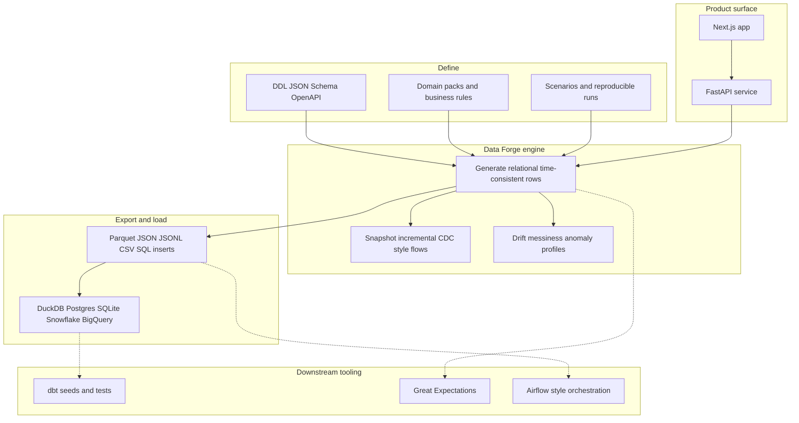
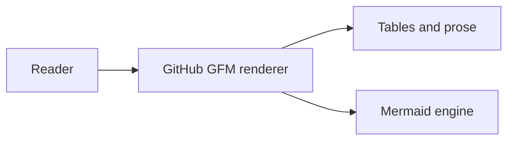

<div id="quick-links" align="center">

<h1>Ojas Shukla</h1>

<p><strong>Senior Data Engineer</strong></p>

<p>Streaming and batch analytics, lakehouse architecture, data governance, synthetic data, and agent-safe SQL.</p>

<p align="center">
  <a href="https://portfolio-ojas-shuklas-projects-7dc8ad06.vercel.app/">Portfolio</a>
  &nbsp;·&nbsp;
  <a href="https://www.linkedin.com/in/ojasshukla01">LinkedIn</a>
  &nbsp;·&nbsp;
  <a href="https://medium.com/@ojasshukla01">Medium</a>
  &nbsp;·&nbsp;
  <a href="https://github.com/ojasshukla01?tab=repositories">Repositories</a>
  &nbsp;·&nbsp;
  <a href="mailto:ojasshukla01@gmail.com?subject=Inquiry%20%E2%80%94%20data%20engineering">Email</a>
</p>

<br />

<sub>Shown when <code>ojasshukla01/ojasshukla01</code> is public. <a href="https://docs.github.com/en/account-and-profile/how-tos/setting-up-and-managing-your-github-profile/customizing-your-profile/managing-your-profile-readme">Profile README docs</a>.</sub>

</div>

---

### Contents

**Profile:** [Overview](#overview) · [Flagship repositories](#flagship-repositories) · [Recent activity](#recent-activity) · [Contact](#contact)

**Deep dive:** [Data Forge](#data-forge-platform-model) · [Technical stack](#technical-stack) · [Repository index](#repository-index) · [Online presence](#online-presence) · [Operating principles](#operating-principles) · [Document notes](#document-notes)

---

## Overview

Senior data engineer with **six years’ experience** delivering **cloud-native** analytics platforms on **AWS**, **GCP**, **Azure**, and **Snowflake**, with depth in **Apache Kafka**, **dbt**, **DuckDB**, and **lakehouse** patterns. Focus areas include **real-time and batch** data pipelines, **observability**, **data governance**, and **open-source** tooling.

| Focus | Project | Description |
|------|---------|-------------|
| Synthetic data | [**Data Forge**](https://github.com/ojasshukla01/data-forge) | Schema-aware, time-consistent test data for databases, APIs, and pipelines |
| Agent safety | [**SQLSense**](https://github.com/ojasshukla01/sqlsense) | MCP server for guardrailed, audited SQL execution for AI agents |
| Developer tooling | [**token-doctor**](https://github.com/ojasshukla01/token-doctor) | Local-first CLI for tokens, changelogs, deprecation windows, and calendars |

```ini
; Machine-readable summary (illustrative)
[profile]
title   = senior_data_engineer
domains = streaming, batch, governance, synthetic_data, agent_safety
stores  = snowflake, bigquery, duckdb, lakehouse
delivery = airflow, cicd, terraform
```

---

## Flagship repositories

Representative open-source work. Contributions welcome where repositories are licensed and document how to contribute.

| Project | Summary | Technologies |
|---------|---------|--------------|
| [**OpenCompliance ESG**](https://github.com/ojasshukla01/opencompliance-esg) | ESG analytics, PDF reporting, data quality | Streamlit, FastAPI, DuckDB, Python |
| [**Data Forge**](https://github.com/ojasshukla01/data-forge) | Time-aware synthetic data; DDL and OpenAPI; CDC-style exports | Python, FastAPI, Next.js, DuckDB, warehouses |
| [**LLM Learning Path Generator**](https://github.com/ojasshukla01/llm-learning-path-generator) | LLM-assisted learning paths and gap analysis | Streamlit, LangChain, DuckDB, OpenAI |
| [**token-doctor**](https://github.com/ojasshukla01/token-doctor) | Token lifecycle debugging, changelogs, sunsets, ICS — local-first | Python, SQLite, CLI |
| [**SQLSense**](https://github.com/ojasshukla01/sqlsense) | Audited, constrained SQL over MCP for software agents | Python, MCP |
| [**Health Analytics BI Dashboard**](https://github.com/ojasshukla01/health-analytics-bi-dashboard) | Healthcare KPIs and business intelligence patterns | Power BI, analytics |

---

## Recent activity

Auto-refreshed markdown (GitHub + Medium). Expand **How this section is updated** for implementation details.

<details>
<summary><strong>How this section is updated</strong></summary>

A GitHub Action runs **once per day** and rewrites the HTML comment markers in this file. Sources: **GraphQL** (paginated public repos; **one combined** query for starred repos + authored PR search; retries on transient failures) and **Medium RSS** (retries). Pattern from <a href="https://simonwillison.net/2020/Jul/10/self-updating-profile-readme/">Building a self-updating profile README for GitHub</a> · <code>scripts/build_readme.py</code> · <code>.github/workflows/update-profile-readme.yml</code> · <a href=".github/dependabot.yml">Dependabot</a>.

</details>

### Latest GitHub releases

<!-- profile_releases starts -->
- [ojasshukla01/data-forge `v0.1.0`](https://github.com/ojasshukla01/data-forge/releases/tag/v0.1.0) — _2026-03-15 · release_
<!-- profile_releases ends -->

### Latest on Medium

<!-- profile_medium starts -->
- [The Architecture of Curiosity: Crafting a Data Engineering Portfolio from Invisible Work](https://medium.com/@ojasshukla01/the-architecture-of-curiosity-crafting-a-data-engineering-portfolio-from-invisible-work-d58ff32e3ee9)
<!-- profile_medium ends -->

### Recent pull requests

One row **per repository** (your most recently updated authored PR in each), so the profile stays easy to scan.

<details>
<summary><strong>Expand pull request list</strong></summary>

<!-- profile_prs starts -->
- [ojasshukla01/data-forge: feat: enhance documentation and CI/CD processes](https://github.com/ojasshukla01/data-forge/pull/13) — _2026-03-22 · merged_
- [raj8github/sqlsense: refactor: clean up imports and exception handling in various modules](https://github.com/raj8github/sqlsense/pull/2) — _2026-03-04 · merged_
<!-- profile_prs ends -->

</details>

### Recently starred repositories

Tools and references I am tracking (public stars). Repositories already shown under **Recent pull requests** are omitted here to avoid duplication.

<details>
<summary><strong>Expand starred repositories</strong></summary>

<!-- profile_starred starts -->
- [duckdb/duckdb](https://github.com/duckdb/duckdb) — _2026-03-03 · starred_
- [DataExpert-io/data-engineer-handbook](https://github.com/DataExpert-io/data-engineer-handbook) — _2026-03-03 · starred_
- [cloudcommunity/Free-Certifications](https://github.com/cloudcommunity/Free-Certifications) — _2026-03-03 · starred_
<!-- profile_starred ends -->

</details>

### Recently updated public repositories

<!-- profile_repos starts -->
- [ojasshukla01/data-forge](https://github.com/ojasshukla01/data-forge) — _2026-03-22_
- [ojasshukla01/token-doctor](https://github.com/ojasshukla01/token-doctor) — _2026-03-05_
- [ojasshukla01/sqlsense](https://github.com/ojasshukla01/sqlsense) — _2026-03-04_
- [ojasshukla01/Torrent_automate](https://github.com/ojasshukla01/Torrent_automate) — _2026-02-28_
- [ojasshukla01/data-pipeline](https://github.com/ojasshukla01/data-pipeline) — _2026-01-31_
- [ojasshukla01/llm-learning-path-generator](https://github.com/ojasshukla01/llm-learning-path-generator) — _2025-10-11_
- [ojasshukla01/hug-lite](https://github.com/ojasshukla01/hug-lite) — _2025-07-15_
- [ojasshukla01/auto-map-au](https://github.com/ojasshukla01/auto-map-au) — _2025-06-13_
<!-- profile_repos ends -->

---

## Data Forge platform model

[**Data Forge**](https://github.com/ojasshukla01/data-forge) is a **time-aware synthetic data** platform: define **schemas and rules** (DDL, JSON Schema, OpenAPI, domain packs), select **generation modes** (snapshot, incremental, CDC-style, medallion layers), and export **privacy-conscious, relational test data** to files and warehouses, with a **Next.js** front end and **Python / FastAPI** API. The diagram below is a simplified architecture view (not all adapters are shown).



---

## Technical stack

| Domain | Technologies |
|--------|----------------|
| **Languages** | [Python](https://www.python.org), SQL, [JavaScript](https://developer.mozilla.org/docs/Web/JavaScript), [R](https://www.r-project.org), [Scala](https://scala-lang.org) |
| **Cloud** | [Google Cloud](https://cloud.google.com), [AWS](https://aws.amazon.com), [Microsoft Azure](https://azure.microsoft.com), [Snowflake](https://www.snowflake.com) |
| **Data and streaming** | [Apache Spark](https://spark.apache.org), [Databricks](https://www.databricks.com), [BigQuery](https://cloud.google.com/bigquery), [Apache Kafka](https://kafka.apache.org), [Apache Airflow](https://airflow.apache.org), [dbt](https://www.getdbt.com), [DuckDB](https://duckdb.org) |
| **Delivery** | [Docker](https://www.docker.com), [Terraform](https://www.terraform.io), [GitHub Actions](https://github.com/features/actions), [Kubernetes](https://kubernetes.io) |

---

## Repository index

### Data platforms and pipelines

- [**Lakehouse360**](https://github.com/ojasshukla01/lakehouse360) — Ingest, transform, data quality; Streamlit, DuckDB, dbt  
- [**Data Engineering Case Studies**](https://github.com/ojasshukla01/data-engineering-case-studies) — Batch and streaming patterns, BigQuery, Airflow, dbt  
- [**auto-map-au**](https://github.com/ojasshukla01/auto-map-au) (AutoMap360) — Suburb-to-region geospatial reference (AU, NZ, IN), Streamlit QA  
- [**data-pipeline**](https://github.com/ojasshukla01/data-pipeline) — Pipeline reference implementation  
- [**bharatstream-sql**](https://github.com/ojasshukla01/bharatstream-sql) — SQL and analytics backend  
- [**streaming-platform**](https://github.com/ojasshukla01/streaming-platform) — Video stack with React  

### Applications and tooling

- [**prompt-hub**](https://github.com/ojasshukla01/prompt-hub) — Prompt management and sharing  
- [**ojas-portfolio**](https://github.com/ojasshukla01/ojas-portfolio) — Portfolio site source  
- [**sop_generator_app**](https://github.com/ojasshukla01/sop_generator_app) · [**sop-generator-frontend**](https://github.com/ojasshukla01/sop-generator-frontend) — Statement-of-purpose tooling  
- [**web-bases-analysis-intrusion-detection-system**](https://github.com/ojasshukla01/web-bases-analysis-intrusion-detection-system) — Network intrusion detection analysis  

### Archive and experiments

- [**git-activity-simulator**](https://github.com/ojasshukla01/git-activity-simulator) — CLI for synthetic Git activity (demonstrations and learning)  
- [**sql-injection**](https://github.com/ojasshukla01/sql-injection) — Security lab (C#)  
- [**Torrent_automate**](https://github.com/ojasshukla01/Torrent_automate) — Automation utilities  
- [**hug-lite**](https://github.com/ojasshukla01/hug-lite) — Lightweight Hugging Face–related experiment  

---

## Online presence

| Channel | Link | Description |
|---------|------|-------------|
| Portfolio | [Professional site (Vercel)](https://portfolio-ojas-shuklas-projects-7dc8ad06.vercel.app/) | Case studies, projects, experience; a **custom domain** shortens the visible URL in the hero if you add one in Vercel |
| Writing | [Medium](https://medium.com/@ojasshukla01) | Data engineering and practice |

Site stack: React, Next.js, Tailwind CSS, Vercel.

---

## Operating principles

- **Engineering discipline** — Prefer composable designs, explicit contracts, and observability where operational risk warrants it.  
- **Quality** — Automated tests and documentation aligned to system boundaries and user-facing behavior.  
- **Collaboration** — Clear technical writing, constructive code review, and open-source releases when they benefit others.  
- **Continuous learning** — Lakehouse platforms, streaming systems, and safe data access in agent-assisted workflows.  

**Additional interests:** Competitive swimming, strategy games, large language models and data systems literature.

---

## Contact

Open to **senior data engineering** roles, **consulting**, **technical writing**, and **mentoring**. Based in **Sydney, Australia**.

**Links:** [same row at the top of this profile](#quick-links) (Portfolio, LinkedIn, Medium, Repositories, Email).

Optional support: [Buy Me a Coffee](https://buymeacoffee.com/ojasshuklav).

---

<div align="center">

**Ojas Shukla** · Senior Data Engineer

<sub>GFM and Mermaid only. <a href="#recent-activity">Recent activity</a> is plain markdown (daily workflow). Pull requests and stars sit in collapsible sections to keep the profile easy to scan.</sub>

</div>

---

## Document notes

Technical reference for this file: GitHub [**profile README**](https://docs.github.com/en/account-and-profile/how-tos/setting-up-and-managing-your-github-profile/customizing-your-profile/managing-your-profile-readme) for `ojasshukla01/ojasshukla01`. Rendered with **GFM** and **Mermaid**.

<details>
<summary><strong>Format, manifest, rendering</strong></summary>

| Component | Role | Reference |
|-----------|------|-----------|
| Diagrams | Architecture | [Mermaid on GitHub](https://github.blog/2022-02-14-include-diagrams-markdown-files-mermaid/) |
| Markup | Structure | [GitHub Flavored Markdown](https://github.github.com/gfm/) |
| Activity lists | Daily workflow: batched GraphQL (stars + PR search in one call; paginated repos), retries on transient errors, stars exclude PR repos, Medium RSS with retries → marker blocks | [`scripts/build_readme.py`](scripts/build_readme.py), [workflow](.github/workflows/update-profile-readme.yml); [Dependabot](.github/dependabot.yml); pattern from [Simon Willison](https://simonwillison.net/2020/Jul/10/self-updating-profile-readme/) |

**Local refresh:** `pip install -r requirements.txt`. `python scripts/build_readme.py --dry-run` loads **Medium** without a token; GitHub sections need a token. Full run: PowerShell `$env:GITHUB_TOKEN = (gh auth token); python scripts/build_readme.py`, or a PAT with scope to read your data via the GraphQL API. Optional: `MEDIUM_FEED_URL` to override the Medium RSS URL.

**GitHub profile:** Pin up to six repositories that match your [Flagship](#flagship-repositories) table so the grid above the README reinforces the same story.

If you adapt this layout, replace `ojasshukla01` in URLs and cite upstream tools you embed.

```json
{
  "kind": "github-profile-readme",
  "repository": "ojasshukla01/ojasshukla01",
  "markdown": "GitHub-Flavored-Markdown",
  "dynamic_assets": [],
  "static_semantics": ["mermaid", "tables", "details-summary", "fenced-code-blocks"]
}
```



</details>
